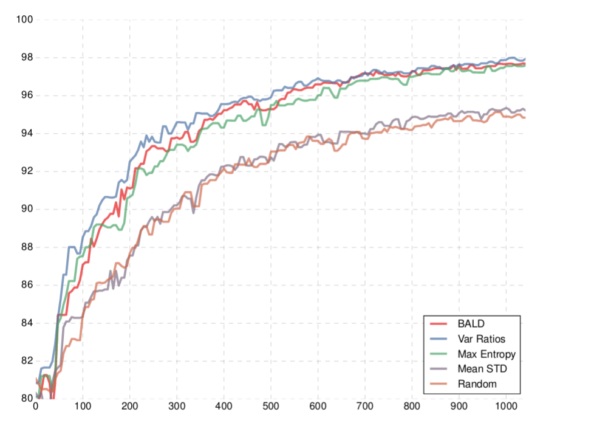
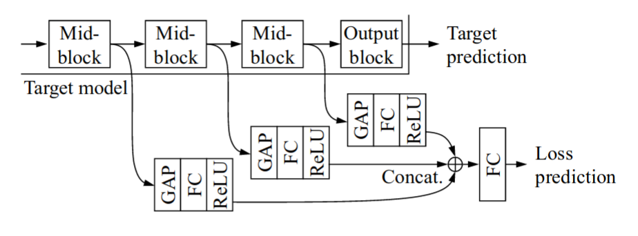
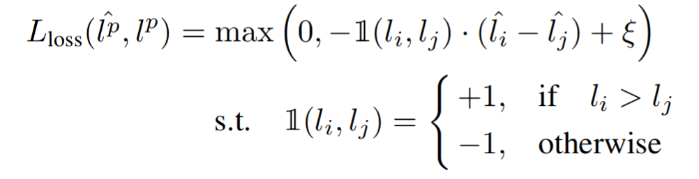
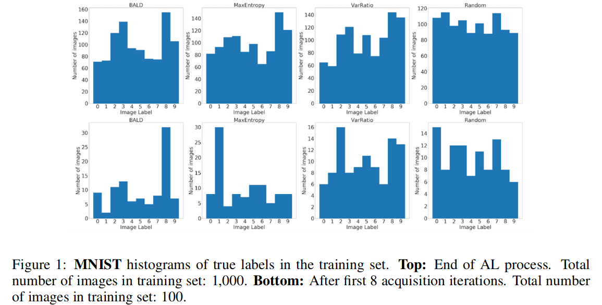
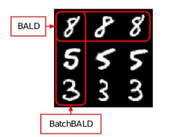
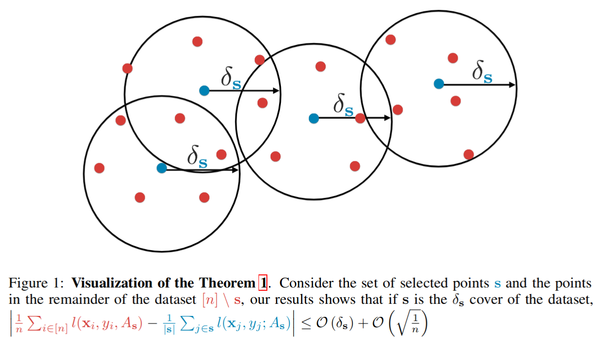



# Table Of Contents
- [Introduction](#introduction)
- [Motivation](#motivation)
- [Active Learning: Higher accuracy with less data annotation](#active-learning--higher-accuracy-with-less-data-annotation)
  * [The unlabeled pool scenario](#the-unlabeled-pool-scenario)
  * [How should we rank the images for annotation ?](#how-should-we-rank-the-images-for-annotation--)
  * [Acquisition functions for uncertainty sampling - examples](#acquisition-functions-for-uncertainty-sampling---examples)
  * [Query by committee QBC](#query-by-committee-qbc)
- [Active Learning for Deep Learning](#active-learning-for-deep-learning)
  * [Deep Bayesian Active Learning with Image Data](#deep-bayesian-active-learning-with-image-data)
    + [Monte Carlo dropout](#monte-carlo-dropout)
    + [Plugging MC Dropout into the Entropy acquisition function](#plugging-mc-dropout-into-the-entropy-acquisition-function)
    + [Bayesian Active Learning by Disagreement BALD](#bayesian-active-learning-by-disagreement-bald)
  * [Learning Loss for Active Learning](#learning-loss-for-active-learning)
  * [Mode collapse in active learning](#mode-collapse-in-active-learning)
  * [Batch aware methods](#batch-aware-methods)
    + [Active Learning for Convolutional Neural Networks: A Core-Set Approach](#active-learning-for-convolutional-neural-networks--a-core-set-approach)
    + [BatchBALD](#batchbald)
    + [Diverse mini-batch Active Learning](#diverse-mini-batch-active-learning)
    + [Deep Batch Active Learning by Diverse, Uncertain Gradient Lower Bounds](#deep-batch-active-learning-by-diverse--uncertain-gradient-lower-bounds)
- [Summary](#summary)


# Introduction

To train supervised machine learning algorithms, we need:

1. Data and annotations for the data.
2. The ability to "learn" from the data, usually by optimizing a model so it fits the data and its annotations.
   

Most of the focus of the machine learning community is about (2), creating better algorithms for learning from data.
But getting useful annotated datasets is difficult. Really difficult. It can be expensive, time consuming, and you still end up with problems like annotations missing from some categories.

I think that being able to build practical machine learning systems is a lot about tools to annotate data, and that a lot of the future innovation in building systems that solve real problems will be about being able to annotate high quality datasets quickly.

Active Learning is a great building block for this, and is under utilized in my opinion.


In this post I will give a short introduction to Classical Active Learning, and then go over several papers that focus on Active Learning for Deep Learning.


# Motivation

In many scenarios we will actually have access to a lot of data, but it will be infeasible to annotate everything.
Just a few examples:

- A billion images scraped from the internet.
- A video recorded from a dash cam that is a month long.
- A scanned biopsy that has a million cells inside it.

There are two closely related fields that help us deal with these scenarios:

* *Semi-supervised Learning*.
Exploit the unannotated data to get better feature representations and improve the algorithms learned on the annotated data.

* *Active Learning*.
 Choose the data that is going to be annotated.
 
 


# Active Learning: Higher accuracy with less data annotation

{:height="300" width="500"}

*Image from https://arxiv.org/abs/1703.02910*

The image above is a typical image in a paper about active learning. 
The x axis is the size of the dataset. The y axis is accuracy on the test set.

A good active learning algorithm is able to cleverly select that data we are going to annotate, so that when we train on it, our model will be better than if we trained on other data.

So if for example we have the constraint of being able to annotate only 400 images, the goal of active learning will be to select the best 400 images to annotate.


## The unlabeled pool scenario

The most common scenario considered in active learning literature, which is also most similar to what happens in real life problems, is the unlabeled pool scenario.
This is a good place to say that I'm going to interchange the words label and annotation, and I'm going to assume we're using images, because the principles will be the same for everything else.

**The unlabeled pool scenario**:

- There is a large pool of unlabeled data.
- We play a round based game.
- Every round we run an algorithm that chooses the best image to annotate from the pool.
This is done by **ranking** the images left in the unlabeled dataset, and choosing the highest ranking image.
- We annotate the selected image and add it to the training set.
- Then we train a  model.

  In active learning papers at this stage usually the model is trained from scratch on the new dataset, but in real-life you're probably going to continue from the previous model you had.
- Repeat until the annotation budget is over.


## How should we rank the images for annotation ?

At this point I want to write something obvious, that's probably worth mentioning anyway. A really good strategy would be to select the images the model is just wrong about.
But we can't do that since we don't know the real labels.


There are two main approaches that most of the active learning works follow.
Sometimes they are a combination of the two.

- **Uncertainty sampling**: Try to find images the model isn't certain about, as a proxy of the model being wrong about the image.
- **Diversity sampling**: Try to find images that represent the diversity existing in the images that weren't annotated yet.


A function that gets an image and returns a ranking score, is often called an "acquisition function" in the literature. 

Let's look a few examples.

## Acquisition functions for uncertainty sampling - examples


Lets look at a few *classic* uncertainty acquisition functions. We will cover some more when we get to the deep learning methods.

1. Entropy $$ H(p) = -\sum p_i Log_2(p_i) $$
   
   $$ H( [0.5, 0.5] ) $$ = 1.0

   $$ H( [1.0, 0.0] ) $$ = 0.0

   This is probably the most important example to understand.
   The idea is that when the model output is the same for all the categories, it is completely confused between the categories.

   The rank will be highest in this case, because the entropy function is maximized the all it's inputs are equal, so we will select the image.
   $$ H $$ will grow as the probabilities p tend to be more uniform, and will shrink when fewer of the categories tend to get higher values.

2. Variation Ratio: $$ 1-max(p) $$

3. The difference between the largest output from the model, and the second largest output.
4. In SVMs: the distance of a point from the hyperplane.

## Query by committee QBC

Another concept from classical active learning papers, is QBC. 
The idea here is that instead of measuring the uncertainty of a single model, we can train an ensemble of many different models (maybe with different seeds, or hyper-parameters, or structures).
Then for a given image, we can check if the output changes a lot between models. If it does, it means the models aren't very consistent about this image, and some of them aren't doing a good job on this image.


In the typical QBC implementation, every model decides the output category and votes for it, and a vector with the vote count is created.


- Some examples of how his vote vector can be used as an uncertainty measure.
	- (Minimize) The difference between the two categories with the most votes.
	
	- (Maximize) Vote Entropy: $$ -\frac{V(c)}{C}Log(\frac{V(c)}{C}) $$


# Active Learning for Deep Learning


Combining Active Learning and deep learning is hard.
1. Deep neural networks aren't really good at telling when they are not sure.
The output from the final softmax layer tends to be over confident.

2. Deep neural networks are computationally heavy, so you usually want to select a **batch** with many images to annotate at once.

   But the acquisition functions we saw so far tell us how to select the single best image, not a batch of images.

   How should we select a batch of images at once? That's an open research question, and we will cover a few *batch aware* methods below.


Now lets cover a few papers about Active Learning for Deep Learning.


## Deep Bayesian Active Learning with Image Data

The paper: [https://arxiv.org/abs/1703.02910](https://arxiv.org/abs/1703.02910)

In my opinion this is the currently the most important paper about active learning for deep learning, so we are going to cover this in detail.

The idea is that Bayesian neural networks give better uncertainty measures.

In a Bayesian neural network, every parameter in the model is sampled from a distribution. Then, when doing inference, we need to integrate over all the possible parameters. So we're using an ensemble of infinite different networks to compute the output.

---

An uncertainty measure from a single network might be flawed (maybe it's over confident in the output), but the idea is that going over many networks is going to improve that. 

Intuitively, if most models agree about one of the categories, the ensembled network will have high confidence for that category. If they disagree, we will get large outputs for several of the categories.

It's intractable to integrate over all possible parameter values in the distribution, so instead Monte Carlo integration can be used.


### Monte Carlo dropout

With Monte Carlo dropout, the idea is that we will simulate a case where every neuron output has a Bernoulli prior, multiplied by some value M (the actual value of that neuron output). 

So a parameter $$ i $$ is going to be 0 with some probability p, and $$ M_i $$ otherwise.

Now we can sample from the neuron priors by running the network and applying dropout at test time.
If we apply dropout many times and sum the results, we're doing Monte Carlo integration.
Lets break this into steps:

1. $$ p(y=c|x) = \int p(y=c|x,\omega)p(w)dw $$

We have a Bayesian neural network and an input image x. To get the output for the category c, we're going over all the possible weight configurations, weighting every configuration by its probability.
2. $$ \approx \int p(y=c|x,\omega)*q^*(w)dw $$
    
    We don't know the actual real parameter distribution, but we can approximate them assuming they belong to the Bernoulli distribution. We can simulate the Bernoulli distribution, simply by using Dropout.

3. $$ \approx \frac{1}{T}\sum_t p(y|x,\omega_t) = \frac{1}{T}\sum_t p^t_c $$
    
    To further approximate, we apply Monte Carlo integration, by running the network with dropout many times, and summing the results.
    As T gets larger, the approximation will get better.

---

This gives us a simple recipe: to approximate the output probability for every category, run the model many times with dropout and taking the average of all the runs.


### Plugging MC Dropout into the Entropy acquisition function
***An example of Uncertainty Sampling***

- The Entropy uncertainty acquisition function is:

  $$ \sum_c p(y=c|x)Log(p(y=c|x)) $$

- If we plug the approximation from above, we get:

  $$ H \approx-\sum_c(\frac{1}{T}\sum_tp_c^t)Log(\frac{1}{T}\sum_tp_c^t) $$


We need to run the network multiple time with dropout, average the outputs, and take the entropy.


Lets see how this measure behaves in two important cases that achieve a high **H**:

1. Every time we run the model with dropout, it's confident about a different category.
   This means that some of the models were very wrong about the input X.
   These models are each associated with a set of parameters that survived the dropout.

   

   **If we select this image, we can correct those parameters that caused the models to be wrong.**


2. Many of the runs end up being not so confident, and are confused between different categories.

   But the many models we sampled actually agree about the input X. They all think it's a confusing example. 
   For example, who knows, maybe there is a large occlusion in the image and we can't clearly see the object we're looking for. How can we ever be correct on this image? If we label this image, how should the model change?


This leads us to a modification that handles the second case:

### Bayesian Active Learning by Disagreement BALD
***An example of Uncertainty Sampling***

In Uncertainty sampling, the ultimate goal would be to find images the model is wrong about.

We can't do that since we don't know the labels. So the idea in BALD is to instead find examples for which many of the different sampled networks are wrong about.

If we sample many networks using MC Dropout, and they disagree about the output, this means that some of them are wrong.


Lets get to the math.  The objective is to find the image that maximizes the mutual information between the model output, and the model parameters.

$$ I(y; \omega | x, D_{train}) = H(y | x, D_{train}) - E_{p(\omega|D_{train})} [H(y|x, \omega, D_{train})] $$  

- The first term looks for images that have high entropy in the average output.
- The second term penalizes images where many of the sampled models are not confident about.
  This keeps only images where the models **disagree** on.


If we plug in the Monte Carlo approximation again, we get:

$$ I(y; \omega | x, D_{train}) \approx-\sum_c(\frac{1}{T}\sum_tp_c^t)Log(\frac{1}{T}\sum_tp_c^t) + \frac 1 T \sum_{t, c} p_c^t Log p_c^t $$

To get the first term, we make many runs, average the output, and measure the entropy.

To get the second term, we make many runs, measure the entropy of every run, and take the average.


## Learning Loss for Active Learning
***An example of Uncertainty Sampling***

The paper: https://arxiv.org/abs/1905.03677

The main idea here is to try to predict what would be the loss of the learning algorithm for a given input.

A higher loss means its a more difficult image and should be annotated.




They extract features from intermediate layers and combine them to predict the network loss.

To learn the loss, you could just add an additional term to the loss: **MSE(Real loss, predicted loss)**.

But during training, the scale of the loss is changing all the time (since the loss is usually going down), and its difficult to learn.

Instead, in this paper they suggest comparing the predicted losses between images. 

- Every batch of size B is split into B/2 pairs of images.
- In every pair, the loss is predicted for both images.
- The two losses are compared with a hinge loss, requiring that the two losses should have a distance of at least $$ \xi $$  between them.



Then during the active learning rounds, you select the images with the highest loss.


## Mode collapse in active learning



*Image from https://arxiv.org/abs/1811.03897*


A possible problem with all these methods, is that during training your dataset won't necessarily be balanced. The acquisition strategy might favor bringing more images from some of the categories.

https://arxiv.org/abs/1811.03897 showed this happens for common uncertainty based acquisition functions: random acquisition ends up bringing a much more balanced dataset than active learning.


I think this is a really nice visualization that shows that scoring images by how difficult they are, won't be 
good enough, and that we have to somehow also optimize for having diverse a diverse dataset.


Of course it's not enough to have enough images from all the categories. Ideally we would capture the sub-categories inside every category as well.


This leads us to the next part about "Batch aware" methods, where we will see some works that try to combine Uncertainty sampling and Diversity sampling.


## Batch aware methods

Most of the active learning works selects a single image, at every active learning round.

However for expensive/data hungry methods like Deep Learning we need to select a batch with many images at every round. After all, we're going to train on the entire new dataset and not just only on the new images, so we can't afford to train again every time a single new image is added to the dataset.


**Problem**: Datasets can have many near duplicates.
If we just select the top ranking images, we might select many near duplicate images that all rank high.



*Image from https://arxiv.org/abs/1906.08158*

Next we are going to go over a few "batch aware" methods, that try to select a good batch of images.


### Active Learning for Convolutional Neural Networks: A Core-Set Approach
***An example of Diversity sampling***

The paper: https://arxiv.org/abs/1708.00489



This paper is an example from the diversity sampling family of active learning algorithms, and is also a "batch aware" method, that tries to choose a batch of B images at once.

The main idea here is that we want the training set to capture the diversity in the dataset. To find the data that isn't represented well yet by the training set, we need to find the "Core Set" at every step.

**The core set**: 
*B images such that when added to the training set, the distance between an image in the unlabeled pool and it's closest image in the training set, will be minimized.*

Finding the ideal B images is NP hard. Instead a simple greedy approximation is used:

- Find an image X with the largest distance from the training set D, add x to D. Repeat B times


How do we define distances between images? It's an open question with place for creativity. 

For images they use the Euclidian distance between feature vectors extracted from the end of the network.


### BatchBALD
***An example of combining Uncertainty and Diversity Sampling***

- The paper: https://arxiv.org/abs/1906.08158
- The authors blog post on this: https://oatml.cs.ox.ac.uk/blog/2019/06/24/batchbald.html

In BALD, the acquisition function for a single data point was the mutual information between the model parameters and the model output:

$$ I(y; \omega | x, D_{train}) = H(y | x, D_{train}) - E_{p(\omega|D_{train})} [H(y|x, \omega, D_{train})] $$  

In this work the goal is to select a batch of images at once, so they the change the acquisition function to:

$$ I(y_1,...,y_B; \omega | x_1,..,x_B, D_{train}) = H(y_1,...,y_B | x_1,...,x_B, D_{train}) - E_{p(\omega|D_{train})} [H(y_1,...,y_B|x_1,...,x_B, \omega, D_{train})] $$


Lets say we have a batch size of 3, and have two images that have a high BALD acquisition score: a and b, and another image that is a duplicate of a: a'.

If we select the batch images one by one, we will select a, a' and b, since they all have high scores.

a' is redundant since it already exists in the batch.

BatchBald won't select a', since it doesn't contribute anything to the total mutual information:

$$ I(a,b,a') = I(a, b) $$


This encourages adding informative images that are different from the rest of the images in the batch.


Approximating 
$$ H(y_1,...,y_B | x_1,...,x_B, D_{train}) $$ 
involves quite a bit of math and details, so refer to the paper for the details.


### Diverse mini-batch Active Learning
***An example of combining Uncertainty and Diversity Sampling***

Paper: https://arxiv.org/abs/1901.05954

The idea here is to combine uncertainty sampling and diversity sampling.

For diversity sampling, they cluster the data into K clusters using K-means (in the case of images, as features they use features extracted from intermediate layers from the neural network classifier).

Then they select images that are closest to the centers of each of the clusters, to make sure the sampled images are diverse.


To incorporate uncertainty sampling and select difficult images, they use **weighted K-means**, where every image is assigned a weight from an uncertainty acquisition function.


Since K-means can be slow, they pre-filter the unlabeled images to keep the top  $$ \beta*K $$  images with the highest uncertainty scores, and do the clustering only on them ($$ \beta $$ is typically 10).


### Deep Batch Active Learning by Diverse, Uncertain Gradient Lower Bounds
***An example of combining Uncertainty and Diversity Sampling***


This is really similar in nature to the previous paper, and in my opinion also to Core Sets, but has a unique twist.

- For uncertainty sampling, instead of using the model output like is usually done, they compute the gradient of the predicted category, with respect to the parameters of the last layer. There are many parameters, so the gradient is a vector. 

  They call these.. *drums roll..*  ***gradient embeddings***.

  The rational here is that when the gradient norm is large, the parameters need to change a lot to be more confident about the category.

  They give the rational that it's more natural to use gradients as uncertainty measures in neural networks, since gradients are used to train the network.

  But this also gives us an embedding we can **cluster** to chose diverse points.
  So it kills two birds with one stone: a way to choose uncertain images, and a way to chose diverse images.

- They then proceed to cluster the embeddings to chose diverse points. Instead of using K-means to choose the batch points, they use a K-means initialization algorithm called K-means++, which is much faster to compute.

What's K-means++? From [Wikipedia](https://en.wikipedia.org/wiki/K-means%2B%2B):

```
1. Choose one center uniformly at random from among the data points.
2. For each data point x, compute D(x), the distance between x and the nearest center that 
has already been chosen.
3. Choose one new data point at random as a new center, using a weighted 
probability distribution where a point x is chosen with probability proportional to D(x)^2.
4. Repeat Steps 2 and 3 until k centers have been chosen.
```

If you recall the Core-Set work, it's really similar to K-means++ !
In Core-Sets, the embeddings were features from one of the last layers. In this work it's almost the same thing, but with gradient embeddings.


# Summary

Thanks for reading. We went over active learning methods for Deep Learning.

These methods are really creative, and it was a joy to write.

We were focusing on images, but these methods can be used for other domains like text.

I hope this will do some help to demystify active learning for Deep Learning.