


- [Background](#background)
- [Q, K, V and Attention.](#q--k--v-and-attention)
- [Visual Examples of K and Q - different patterns of information flowing](#visual-examples-of-k-and-q---different-patterns-of-information-flowing)
  * [Pattern 1 - The information flows in one direction](#pattern-1---the-information-flows-in-one-direction)
  * [Pattern 2 - The information flows in two directions](#pattern-2---the-information-flows-in-two-directions)
- [How do the Attention Activations look like for the class token throughout the network?](#how-do-the-attention-activations-look-like-for-the-class-token-throughout-the-network-)
- [Attention Rollout](#attention-rollout)
  - [We have multiple attention heads. What do we do about them?](#we-have-multiple-attention-heads-what-do-we-do-about-them-)
- [Modifications to get Attention Rollout working with Vision Transformers](#modifications-to-get-attention-rollout-working-with-vision-transformers)
  * [The way we fuse the attention heads matters](#the-way-we-fuse-the-attention-heads-matters)
  * [We can focus only on the top attentions, and discard the rest](#we-can-focus-only-on-the-top-attentions--and-discard-the-rest)
- [Gradient Attention Rollout for Class Specific Explainability](#gradient-attention-rollout-for-class-specific-explainability)
  * [Where does the Transformer see a Dog (category 243), and a Cat (category 282)?](#where-does-the-transformer-see-a-dog--category-243---and-a-cat--category-282--)
  * [Where does the Transformer see a Musket dog (category 161) and a Parrot (category 87)?](#where-does-the-transformer-see-a-musket-dog--category-161--and-a-parrot--category-87--)
- [What Activation Maximization Tells us](#what-activation-maximization-tells-us)
- [Summary](#summary)


# Background

In the last few months before writing this post, there seems to be a sort of a breakthrough in bringing Transformers into the world of Computer Vision.

To list a few notable works about this:

- [An Image is Worth 16x16 Words: Transformers for Image Recognition at Scale](https://arxiv.org/abs/2010.11929), 
- [Training data-efficient image transformers & distillation through attention](https://arxiv.org/abs/2012.12877)


If I can make a prediction for 2021 - in the next year we are going to see **A LOT** of papers about using Transformers in vision tasks (feel free to comment here in one year if I'm wrong).


But what is going on inside Vision Transformers? How do they even work? Can we poke at them and dissect them into pieces to understand them better?


---


"Explainability" might be an ambitious and over-loaded term that means different things to different people, but when I say Explainability I mean the next things:

- *(useful for the developer)* **What's going on inside when run the Transformer on this image?** 
  Being able to look at intermediate activation layers.
  In computer vision - these are usually images!
  These are kind of interpretable since you can display the different channel activations as 2D images.

  

- *(useful for the developer*) **What did it learn?**
  Being able to investigate what kind of patterns (if any) did the model learn.
  Usually this is in the form of the question "What input image maximizes the response from this activation?" , and you can use variants of "Activation Maximization" for that.

- *(useful for both the developer and the user)* **What did it see in this image?**
  Being able to Answer "What part of the image is responsible for the network prediction", sometimes called "Pixel Attribution".


*So we are going to need this for Vision Transformers as well!*


In this post we will go over my attempt to do this for Vision Transformers.


Everything here is going to be done with the recently released 'Deit Tiny' model from Facebook, i.e:

```python
model = torch.hub.load('facebookresearch/deit:main', 'deit_tiny_patch16_224', pretrained=True)
```

And we are going to assume 224xx224 input images to make it easier follow the shapes, although it doesn't have to be.


Python code is released here: https://github.com/jacobgil/vit-explain


The rest of this post assumes you understand how Vision Transformers work.

They are basically vanilla transformers, but the images are split into 14x14 different tokens, where every token represents a 16x16 patch from the image. 


Before continuing, you might want to read the two papers given above, and these blog posts about them:

- https://ai.googleblog.com/2020/12/transformers-for-image-recognition-at.html

- https://ai.facebook.com/blog/data-efficient-image-transformers-a-promising-new-technique-for-image-classification

  

# Q, K, V and Attention.


A Vision Transformer is composed of a few Encoding blocks, where every block has:

- A few attention heads, that are responsible, for every patch representation, for fusing information from other patches in the image.
- An MLP that transforms every patch representation into a higher level feature representation. 
- Both have residual connections.
  **And we will see them in action!**


It's as simple as this, taken from Ross Wightman's [Amazing Pytorch Image Models package implementation of vision transformers](https://github.com/rwightman/pytorch-image-models/blob/master/timm/models/vision_transformer.py):

```python
    def forward(self, x):
        x = x + self.drop_path(self.attn(self.norm1(x)))
        x = x + self.drop_path(self.mlp(self.norm2(x)))
        return x
```


Inside every attention head (the 'Deit Tiny' model has 3 attention heads in every layer), the players are Q,k and V.

The shape of each of these are - `3x197x64`

- There are 3 attention heads.

- Each attention heads sees 197 tokens.

- Every token has a feature representation of length 64.

  Among these 197 tokens, 196 represent the original image 14x14=196 image patches, and the first token represents a class token that flows through the Transformer, and will be used at the end to make the prediction.


**If for every attention head separately, we look inside the second dimension with 197 tokens, we can peek at the last 14x14=196 tokens.**


This gives us an image of size 14x14x64 which we can then visualize.**


The rows of Q and K, are 64 length feature that represents a location in the image.

We can then think of Q, K and V in the next way:
For every image patch with $$ q_i $$, Information is going to flow from locations in the image that have keys $$ k_j $$ that are similar to that $$ q_i $$.

 


*image from http://jalammar.github.io/illustrated-transformer*


# Visual Examples of K and Q - different patterns of information flowing

Lets look at an example.

The input to the network is this image of a plane:


We can now look at the Q and K images in different layers, and visualize them for one of the 64 channels.

This activation vector is going to be a 14x14 image, with positive and negative values, that seem to be in the range [-5, 5]. 


- $$ q_i $$ is the Query feature vector for one of the locations i in the image.
- $$ k_j $$ is the key feature vector for one of the locations j in the image.


**Here is a tricky part:**

For every pixel in K, we can ask "how is that location going to spread information to other parts of the image?"
Since we take the dot product between the token vectors (every q_i and k_j), there are three scenarios:

- Two different pixels in $$ q_i $$ and  $$ k_j $$ have the same sign (both are positive or negative)- their multiplication is positive.
  This means that the pixel in $$ k_j $$ is going to contribute to flowing information into that location $$ q_i $$.
- Two different pixels in $$ q_i $$ and $$ k_j $$ have different signs (one is positive and one is negative)- their multiplication is negative.
  This means that the pixel in $$ k_j $$ is NOT going to contribute to flowing information into that location in $$ q_i $$.


To contrast the negative and positive pixels, we're going to pass every image through a `torch.nn.Sigmoid()` layer (the bright values are positive, the dark values are negative).


From looking at the Q,K visualizations for different channels I think there are kind of two patterns that emerge.

## Pattern 1 - The information flows in one direction

**Layer 8, channel 26, first attention head:**

| Query image                                     | Key image                                       | Original                      |
| ----------------------------------------------- | ----------------------------------------------- | ----------------------------- |
| 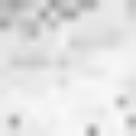 | 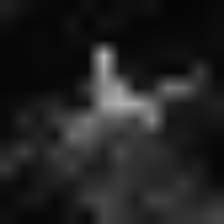 |  |


- The key image highlights the Airplane.
- The query image highlights all the image.

For most locations in the Query image, since they are positive, information is going to flow to them only from the positive locations in the Key image - that come from the Airplane.


Q, K here are telling us -


 `We found an airplane, and we want all the locations in the image to know about this!`

## Pattern 2 - The information flows in two directions

**Layer 11, channel 59, first attention head:**

| Query image                        | Key image                          | Original        |
| ---------------------------------- | ---------------------------------- | --------------- |
| 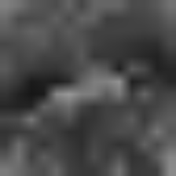 | 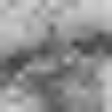 |  |


- The Query image highlights mainly the bottom part of the Airplane.
- The image is Negative in the top part of the Airplane.


The information flows in two directions here:

- The top part of the plane (negative values in the Key) is going to spread into all the image (negative values in the Query).
  
- `Hey we found this plane, lets tell the rest of the image about it.`
  
- Information from the "Non Plane" parts of the image (positive values in the Key) is going to flow into the bottom part of the Plane (positive values in the Query).
  
  
  
  `Lets tell the plane more about what's around it.`
  
  

# How do the Attention Activations look like for the class token throughout the network?

Another thing we can do is visualize how the attention flows for the class token, in different layers in the network.

Since we have multiple attention heads, to keep it simple we will just look at the first one.


The attention matrix ($$ Q*K^T $$) has shape 197x197.

If we look at the first row (shape 197), and discard the first value (left with shape 196=14x14) that's how the information flows from the different locations in the image to the class token.

Here is how the class attention activations looks like through the layers:

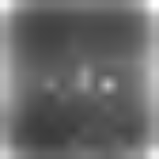 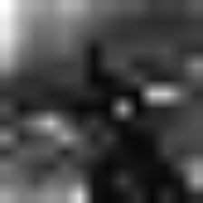 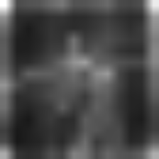 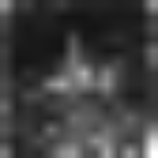 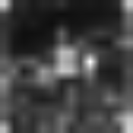 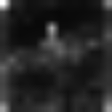 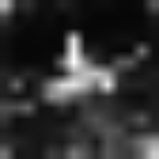 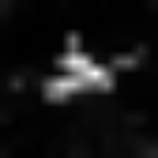 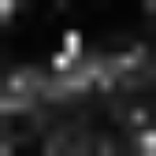 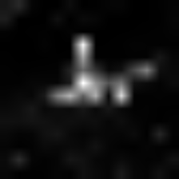 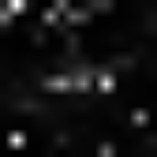 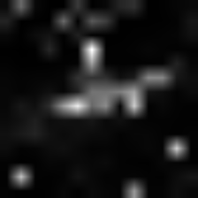 


It looks like from layer 7 the network was able to segment the plane pretty well.

However - if we look at consecutive layers, some plane parts are lost, and then re-appear again:

   


**And we can thank the residual connections for this!**

Although the attention suddenly discarded parts of the plane (the middle image above), we don't loose that information since we have a residual connection from the previous layer.


# Attention Rollout 

The images above show us how individual activations look like, but they don't show us how the attention flows from the start to the end throughout the Transformer.


To quantify this we can use a technique called "Attention Rollout" from [Quantifying Attention Flow in Transformers](https://arxiv.org/abs/2005.00928)

This is also what the authors at [An Image is Worth 16x16 Words: Transformers for Image Recognition at Scale](https://arxiv.org/abs/2010.11929) suggested.


At every Transformer block we get an attention Matrix $$ A_{ij} $$ that flows the defines how much attention is going to flow from token j in the previous layer to token i in the next layer.


We can multiply all the Matrices between two layers, to get the total attention flow between them.

However - we also have the residual connections (like we saw in the previous section). 

We can model them by adding the identity matrix I to the layer Attention matrices:  $$ A_{ij} + I $$.


#### We have multiple attention heads. What do we do about them?

The Attention rollout paper suggests taking the average of the heads.
As we will see, it can make sense using other choices: like the minimum, the maximum, using different weights.


Finally we get:

$$ AttentionRollout_{L} = (A_l + I ) \dot AttentionRollout_{L-1} $$

*We also have to normalize the rows, to keep the total attention flow 1.*

# Modifications to get Attention Rollout working with Vision Transformers

I implemented this and ran this on the recent 'Data Efficient' models from Facebook, but the results weren't quite as nice as in the [An Image is Worth 16x16 Words: Transformers for Image Recognition at Scale](https://arxiv.org/abs/2010.11929),  paper.

Results were very noisy, and the attention doesn't seem to focus only on the interesting part of the image.


Trying to get this to work, I noticed two things:

## The way we fuse the attention heads matters

For example, here is how the result look if we take minimum value among the attention heads, instead of the mean value as suggested in the Attention Rollout paper:

| Image                                                        | Mean Fusion                                                  | Min Fusion                                                   |
| ------------------------------------------------------------ | ------------------------------------------------------------ | ------------------------------------------------------------ |
|  |  |  |


Different attention heads look at different things, so I guess taking the minimum removes noise by finding their dominator. 

However, combined with discarding low attention pixels (next section), fusing the attention heads with the maximum operator seems to work best.

## We can focus only on the top attentions, and discard the rest

Discarding the lowest attention values has a huge effect in how the results look like.

Here is it how it looks as we increase the portion of attention pixels we discard:

 


As you can see, the more pixels we remove, we are able to better isolate the salient object in the image.

Finally, here is how it looks like for a few different images:

| Image                                                        | Vanilla Attention Rollout                                    | With discarding lowest pixels + max fusion                   |
| ------------------------------------------------------------ | ------------------------------------------------------------ | ------------------------------------------------------------ |
|  |  |  |
|  |  |  |
|  |  |  |
|  |  |  |

# Gradient Attention Rollout for Class Specific Explainability

Another question we can ask is - "What in the image contributes to a higher output score in category 42?"

Or in other words, Class Specific Explainability. 


When fusing the attention heads in every layer, we could just weight all the attentions (in the current implementation it's the attentions after the softmax, but maybe it makes sense to change that) by the target class gradient, and then take the average among the attention heads. 


$$ A_{ij} * grad_{ij} $$

## Where does the Transformer see a Dog (category 243), and a Cat (category 282)?

 

## Where does the Transformer see a Musket dog (category 161) and a Parrot (category 87)?

 

# What Activation Maximization Tells us

Another thing we can do, is apply Activation Maximization, to find the kind of image inputs that maximize different parts in the network.

In Vision Transformers the image are split into 14x14 independent patches (that represent 16x16 pixels). 

We also see this in the Activation Maximization result below- instead of getting a continuous image, we get 14x14 patches.


Since the positional embeddings are added to the inputs, nearby patches should get more similar outputs.

I think you can see this in the image below - many neighboring patches look similar, but they also have a discontinuity between them.

I guess future work can be about using some kind of a spatial continuity constraint between the patches here (and maybe also incorporate that into how the transformers process the images).

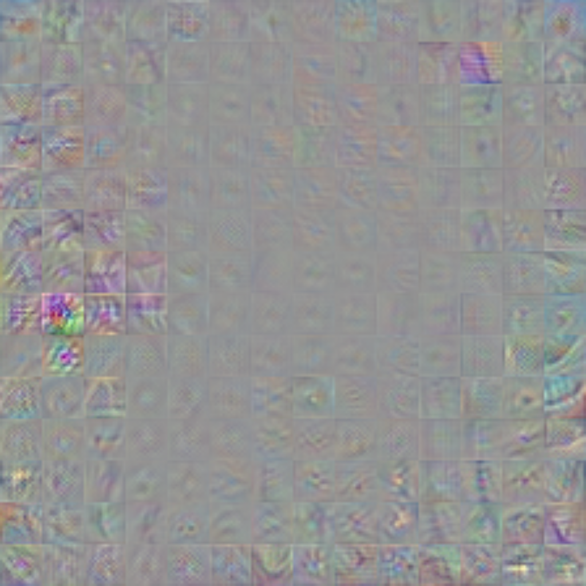


# Summary

In this post we applied Explainability techniques for Vision Transformers.

This was my attempt to try to better understand how are they working and what's going inside.

You can access the code here: https://github.com/jacobgil/vit-explain

I hope you enjoyed.